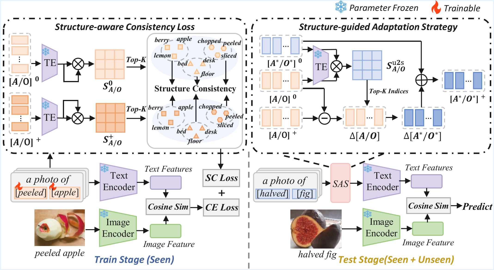

<div align="center">

# Structure-aware Prompt Adaptation from Seen to Unseen for Open-Vocabulary Compositional Zero-Shot Learning

### IEEE Transactions on Multimedia (TMM), 2026

Yihang Duan · Jiong Wang · Pengpeng Zeng · Ji Zhang · Lei Zhao · Chong Wang · Jingkuan Song · Lianli Gao

[](https://ieeexplore.ieee.org/document/11594944)
[](https://arxiv.org/abs/2603.03815)
[](https://doi.org/10.1109/TMM.2026.3710110)

</div>

This repository provides the official PyTorch implementation of **Structure-aware Prompt Adaptation (SPA)** for open-vocabulary compositional zero-shot learning (OV-CZSL).

## 📢 News

- **[2026-07]** Training and evaluation code is released.
- **[2026-03]** SPA has been accepted by IEEE Transactions on Multimedia (TMM).

## 🔍 Overview

OV-CZSL requires a model to recognize compositions containing both seen and unseen attributes and objects. Prompt-tuning methods learn effective representations for seen primitives, but their learned prompts do not naturally transfer to concepts that are absent during training.

SPA addresses this problem by exploiting the local semantic structures shared by related primitives. It consists of two complementary components:

- **Structure-aware Consistency Loss (SCL):** preserves the local structures of seen attributes and objects during training.
- **Structure-guided Adaptation Strategy (SAS):** transfers the learned prompt shifts from semantically related seen primitives to unseen primitives during inference.

SPA is designed as a plug-and-play approach. This repository integrates it with **CSP**, **HPL**, **DFSP**, and **Troika**, and supports experiments on **MIT-States**, **C-GQA**, and **VAW-CZSL**.

<p align="center">
  
</p>

<p align="center">
  Overview of the proposed Structure-aware Prompt Adaptation framework.
</p>

## 🛠️ Installation

The code has been tested with Python 3.9, PyTorch 1.12.1, and CUDA GPUs.

```bash
git clone https://github.com/ZHlo-404/SPA.git
cd SPA

conda create -n spa python=3.9 -y
conda activate spa

# Reproduce the tested PyTorch 1.12.1 + CUDA 11.3 setup.
conda install pytorch==1.12.1 torchvision==0.13.1 cudatoolkit=11.3 -c pytorch

pip install -r requirements.txt
```


## 📂 Data Preparation

Download the image data for MIT-States, C-GQA, or VAW-CZSL and keep the auxiliary split files provided in `data_files/`. The dataset root can be supplied from the command line, so no local absolute path needs to be written into a configuration file.


## 🚀 Training

Configuration files follow the naming convention `config/<method>_<dataset>.yml`, where:

- `<method>` is `csp`, `hpl`, `dfsp`, or `troika`;
- `<dataset>` is `mit`, `cgqa`, or `vaw`.

For example, train SPA with CSP on MIT-States using one GPU:

```bash
CUDA_VISIBLE_DEVICES=0 python train.py \
  --method csp \
  --cfg config/csp_mit.yml \
  DATASET.root_dir /path/to/mit-states
```

The same entry point is used for every supported method and dataset. Replace `--method`, `--cfg`, and `DATASET.root_dir` as needed.

Checkpoints and TensorBoard logs are saved under `checkpoints/` and `tensorboards/`, respectively.

### Multi-GPU Training

The method-specific training scripts launch distributed workers internally. Set the visible devices and override `DISTRIBUTED.world_size`; do not wrap the command with `torchrun`.

```bash
CUDA_VISIBLE_DEVICES=0,1,2,3 python train.py \
  --method csp \
  --cfg config/csp_mit.yml \
  DATASET.root_dir /path/to/mit-states \
  DISTRIBUTED.world_size 4
```

## 📊 Evaluation

Provide the method, its matching configuration, and the checkpoint to evaluate:

```bash
CUDA_VISIBLE_DEVICES=0 python eval.py \
  --method csp \
  --cfg config/csp_mit.yml \
  --checkpoint checkpoints/csp_mit_124/model_epoch_best.pth \
  DATASET.root_dir /path/to/mit-states
```

The evaluator reports open-vocabulary seen/unseen accuracy, harmonic mean, and AUC metrics.

## 📝 Citation

If you find this work useful, please cite:

```bibtex
@article{duan2026spa,
  title   = {Structure-aware Prompt Adaptation from Seen to Unseen for Open-Vocabulary Compositional Zero-Shot Learning},
  author  = {Duan, Yihang and Wang, Jiong and Zeng, Pengpeng and Zhang, Ji and Zhao, Lei and Wang, Chong and Song, Jingkuan and Gao, Lianli},
  journal = {IEEE Transactions on Multimedia},
  pages   = {1--13},
  year    = {2026},
  doi     = {10.1109/TMM.2026.3710110}
}
```

## 📬 Contact

For questions or issues, please open an issue in this repository.
